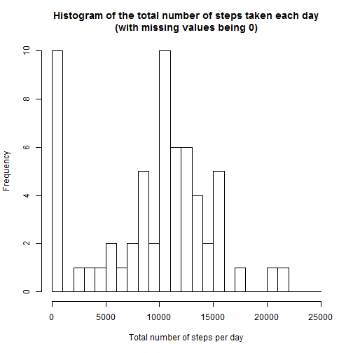
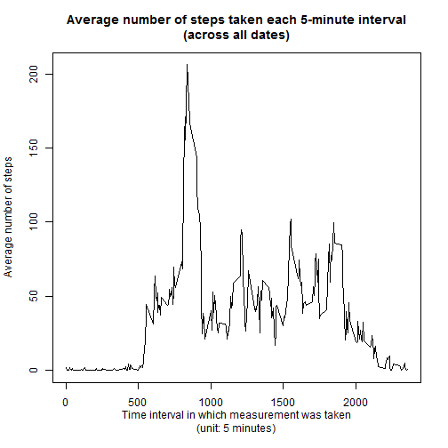
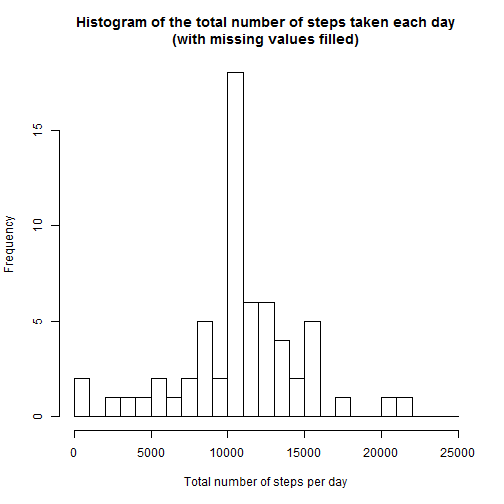
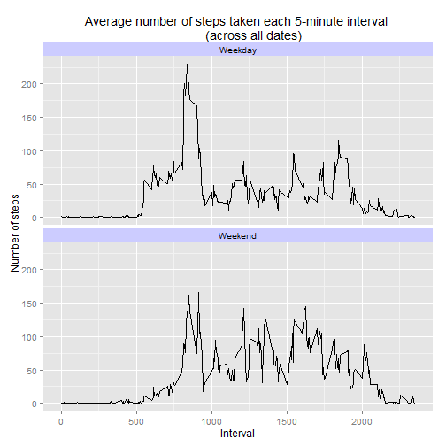

Reproducible Research
=====================
#### Course Project - Peer Assessment 1


## Loading and preprocessing the data

Before we start, firstly, we set the working directory to the folder where the data file *activity.csv* is saved. 

Now We load the data by using the function `read.csv()`.


```r
activity <- read.csv("activity.csv")
```

Then we transform the data frame `activity` into a tbl objects, which is named as `activity_tbl` for further analysis. The **dplyr** package is used.


```r
library(dplyr)
activity_tbl <- tbl_df(activity)
```

We may have a look at what `activity_tbl` is like by directly typing its name in the console. 

Now we continue to the next four parts of this assignment:  

    1.  What is mean total number of steps taken per day?
    2.  What is the average daily activity pattern?
    3.  Imputing missing values.
    4.  Are there differences in activity patterns between weekdays and weekends?


## 1. What is mean total number of steps taken per day?

**(1) Calculate the total number of steps taken per day:**

We create a grouped object `by_date` with `group_by()` and then use `summarise()` to do the computation.


```r
by_date <- group_by(activity_tbl, date)
steps_per_day <- summarise(by_date, total_steps = sum(steps, na.rm = TRUE))
```

**(2) Make a histogram of the total number of steps taken each day:**

(Here we set the bin width to be 1000.)


```r
hist(steps_per_day$total_steps, 
     breaks = seq(0, 25000, 1000), 
     main = "Histogram of the total number of steps taken each day\n(with missing values being 0)", 
     xlab = "Total number of steps per day")
```

 

**(3) Calculate and report the mean and median of the total number of steps taken per day:**

(We set the option `scipen` to be a positive value to avoid the scientific formatting.)


```r
options(scipen=999)
summary_info <- summary(steps_per_day$total_steps)
mean <- summary_info[[4]]
median <- summary_info[[3]]
```

The mean is **9354**; and the median is **10400**.

## 2. What is the average daily activity pattern?

**(1) Make a time series plot (i.e. type = "l") of the 5-minute interval (x-axis) and the average number of steps taken, averaged across all days (y-axis)**

We create a grouped object `by_interval` with `group_by()` and then use `summarise()` to do the computation.


```r
by_interval <- group_by(activity_tbl, interval)

steps_by_interval <- summarise(by_interval, average = mean(steps, na.rm = TRUE))
```

Now we make the time series plot by the following codes; and the graph is shown below the codes.


```r
plot(x = steps_by_interval$interval, 
     y = steps_by_interval$average, 
     type = "l", 
     main = "Average number of steps taken each 5-minute interval\n(across all dates)", 
     xlab = "Time interval in which measurement was taken\n(unit: 5 minutes)",
     ylab = "Average number of steps")
```

 


**(2) Which 5-minute interval, on average across all the days in the dataset, contains the maximum number of steps?**

We sort the data `steps_by_interval` in  decreasing order of the `average`. 


```r
steps_by_interval_sorted <- arrange(steps_by_interval, desc(average))
max_interval <- steps_by_interval_sorted$interval[1]
```

The identifier of the interval that has the maximum average number of steps is **835**.

## 3. Imputing missing values

**(1) Calculate and report the total number of missing values in the dataset** (i.e. the total number of rows with `NAs`)


```r
na_rows <- sum(is.na(activity$steps))
```

The total number of missing values in the dataset is **2304**.

**(2) Devise a strategy for filling in all of the missing values in the dataset. The strategy does not need to be sophisticated.**

*We replace the `NA` with the mean for the corresponding 5-minute interval. That is, the missing value for a certain 5-minute interval will be replaced by the the average for that 5-minute interval, which is calculated across all the days in the dataset. Those average values have been available in `steps_by_interval` calculated above.*

**(3) Create a new dataset that is equal to the original dataset but with the missing data filled in.**

We create the new dataset as a data frame stored in `activity_2`.


```r
activity_2 <- activity

for (i in which(is.na(activity_2$steps))) {
    interval_id <- which(steps_by_interval$interval == activity_2[i, 3])
    activity_2[i, 1] <- round(steps_by_interval[interval_id, 2])
}
```

**(4) Make a histogram of the total number of steps taken each day; and calculate and report the mean and median total number of steps taken per day.** 

- ***Do these values differ from the estimates from the first part of the assignment?***
- ***What is the impact of imputing missing data on the estimates of the total daily number of steps?***

We repeat the process in the first part of the assignment but save all the computed results to variables named differently from the first part.


```r
by_date_2 <- group_by(activity_2, date)
steps_per_day_2 <- summarise(by_date_2, total_steps = sum(steps, na.rm = TRUE))
```

Here is the new histogram.


```r
hist(steps_per_day_2$total_steps, 
     breaks = seq(0, 25000, 1000), 
     main = "Histogram of the total number of steps taken each day\n(with missing values filled)", 
     xlab = "Total number of steps per day")
```

 

```r
summary_info_2 <- summary(steps_per_day_2$total_steps)
mean_1 <- summary_info_2[[4]]
median_2 <- summary_info_2[[3]]
```

The mean and median total number of steps taken per day are **10770** and **10760**, respectively, which are both greater than the estimates from the first part of the assignment. 

In the first part, `NAs` were treated as "0", so that the frequency of total steps per day being less than "1000" (i.e. the "0-1000" bin in the histogram above) decreases significantly. Furthermore, also in the first part, `NAs` were ignored when we calculate the mean and median, so that imputing missing data increases those estimates in this part. 

## 4. Are there differences in activity patterns between weekdays and weekends?

**(1) Create a new factor variable in the dataset with two levels - "Weekday" and "Weekend" indicating whether a given date is a weekday or weekend day.**

(Note that weekend includes Saturday" and "Sunday".)


```r
activity_3 <- mutate(activity_2, day = weekdays(as.Date(activity_2$date)))
activity_3$day <- as.factor(ifelse(activity_3$day %in% c("Saturday","Sunday"),
                                   "Weekend", "Weekday"))
```

**(2) Make a panel plot containing a time series plot (i.e. type = "l") of the 5-minute interval (x-axis) and the average number of steps taken, averaged across all weekday days or weekend days (y-axis).**


```r
by_interval_day <- group_by(activity_3, interval, day)
steps_by_interval_day <- summarise(by_interval_day, average = mean(steps))
```

Now we make the panel plot by using **ggplot2** package. The graph is shown below the codes.


```r
library(ggplot2)
g <- ggplot(steps_by_interval_day, aes(interval, average)) + geom_line()

g + facet_wrap(~ day, ncol = 1) + 
    labs(title = "Average number of steps taken each 5-minute interval 
         (across all dates)") + 
    labs(x = "Interval", y = "Number of steps") + 
    theme(strip.text = element_text(size = 10), 
        strip.background = element_rect(fill="#CCCCFF"))
```

 
